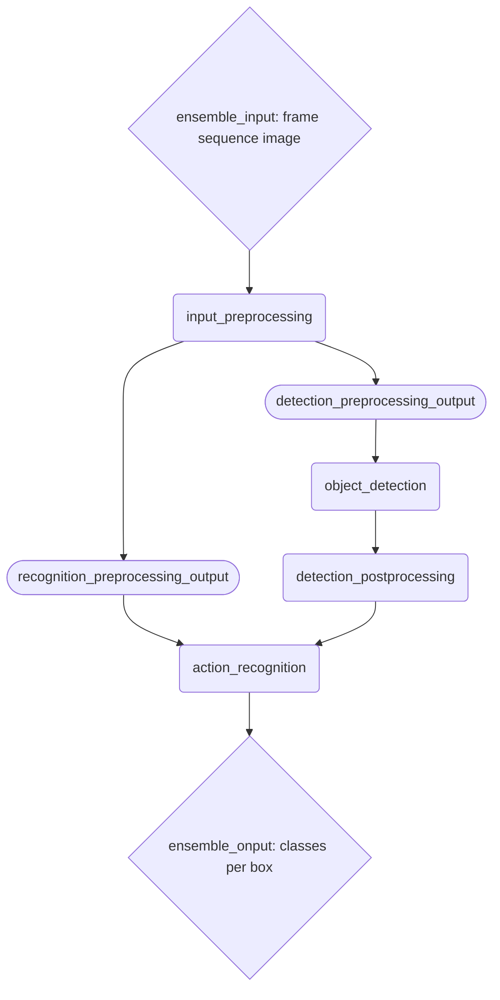

# triton-inference-server

Triton Inference Server with http/rest, grpc


```
# Run Triton Inference Server

docker run -it --rm --gpus device=1 -p 8001:8001 -p 8002:8002 -p 8000:8000 --shm-size=256m -v ${PWD}/model_repository:/models nvcr.io/nvidia/tritonserver:23.07-py3 bash

pip install torch torchvision opencv-python
apt update; apt -y install libgl1-mesa-glx
tritonserver --model-repository=/models --model-control-mode=poll
# Run TensorRT build 
docker run -it --rm -v ${PWD}/model_repository:/models nvcr.io/nvidia/tensorrt:23.01-py3 

trtexec --onnx=/models/action_recognition/1/model.onnx --saveEngine=/models/model.plan --batch=1 --maxBatch 4 --shapes=frames:4x3x16x640x360,boxes:1x5
trtexec --onnx=/models/action_recognition/1/model.onnx --saveEngine=/models/model.plan --minShapes=modelInput:1x3x16x224x224 --maxShapes=modelInput:4x3x16x224x224
trtexec --onnx=/models/action_recognition/3/model.onnx --saveEngine=/models/model.plan --shapes=modelInputFrames:1x3x16x640x360,modelInputBoxes:1x3x5

trtexec --onnx=/models/videomae_onnx/1/model.onnx --saveEngine=/models/videomae_trt/model.plan --batch=1 --maxBatch 4 --shapes=modelInput:4x3x16x224x224
trtexec --onnx=/models/videomae_onnx/1/model.onnx --saveEngine=/models/model.plan --minShapes=modelInput:1x3x16x224x224 --maxShapes=modelInput:4x3x16x224x224

# Run analyze

docker run -it --rm --network=host nvcr.io/nvidia/tritonserver:23.01-py3-sdk bash

perf_analyzer --service-kind triton -m videomae_trt -x 1 -i grpc --concurrency-range 4:12 -b 1:4 --input-data random --shared-memory cuda
perf_analyzer --service-kind onnx -m Direct_MHP -x 1 -i grpc --concurrency-range 1:6 -b 4 --input-data random --shared-memory cuda

polygraphy inspect model /models/videomae_onnx/1/model.onnx 
polygraphy inspect model /models/model_repository/videomae_trt/1/model.plan


```


